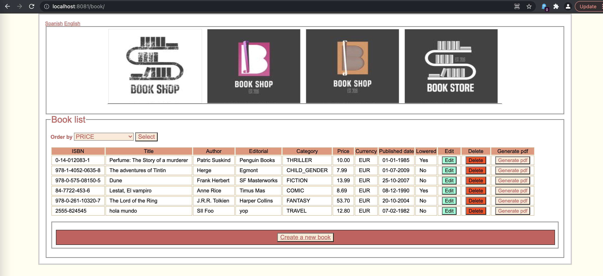

# Project Bookstore
## About Bookstore

This is a basic project about a little library that helped me understand how to work with Spring Boot and I want it to share with you.




This library shows the list of books and its details like price, author, category, title and little more. 
You can edit, delete and generate pdf for each book, and of course create a new one, which you will see in the main list.

Also, if you are looking for some specific information, you could sort it by a different column than the one in the list.

The languages, I chose to give you two options: English and Spanish.

---

## Architecture

The design pattern I used was Model-View-Controller (MVC).

The dependencies are managed by Maven

The database is H2


### Model
  
In the package `domain` we could find the POJO `Book.java` that it has all characteristics for the books.
I managed it with `@annotation`, that was useful to create getters, setters, constructors, toString(), and the Entity for the database.
The table name is the same as the class one.

```Java
@Getter
@Setter
@NoArgsConstructor
@ToString
@Entity
@Table
public class Book implements Serializable {}
```
After this, we need to create the repository. This is an interface that we are using with all queries. 

Spring Boot is really helpful with that. The basic queries are all created just by extending `JpaRespsitory<Class.java, Long>`. The more specific queries, I created them manually, using Spring method naming conventions, i.e., `List<Book> findAllByOrderByAuthor();`.

Annotations in Spring Boot are important. In this case, `@Repository` indicates that this interface will be our repository. So when we do any query, Spring Boot knows what Bean is and uses it. If you forget indicate any annotations in the class or interface, Spring Boot will never recognize it as a Bean.

```Java
@Repository
public interface BookRepository extends JpaRepository<Book, Long> {}
```

In the service class I  `@Autowired` the repository, (the famous word in Spring Boot, that helps with dependencies injection), so  I could have access to all the queries.
Again, don´t forget the annotation `@Service`.

```Java
@Service
public class BookService  {

    @Autowired
    private BookRepository bookRepository;
    
}
```

Finally, I created different Enum classes to manage the options to sort by, to choose currency and category, those are the ones I used in my queries.

### View

The templating engine used for the view is `Thymeleaf`. 


### Controller

My controller `BookStoreController.java` responds to the bookstore HTTP requests, loads the data Model and returns the views.

The base url in the request mapping is "/book", but we need to call "/book/" or "/book/list" to get a successful response.
I use a method `view(Model model)` to show the main list with all books.

```Java
@Controller
@RequestMapping("/book")
public class BookStoreController {

    @Autowired
    private BookService bookService;
    
    @GetMapping({"/", "/list"})
    public String view(Model model) {
        model.addAttribute("allbooks", this.bookService.findAll());
        return "list";
    }
}
```

### Dependencies

I used Maven to manage all dependencies:
- lombok
- h2database
- springboot
- springBootDataJpa
- springBoot-web
- springBoot-Thymeleaf
- apache.pdfbox
 
### Database

 - `data.sql`
 
 In this file I created some initial information about books, and save it into the database. 
 All information that we will modify is only temporal, in any case, if you want to change any information, you are available to do it using this file.

### i18n

- `messages.properties`
- `messages_es.properties`

## How to run the project

To run this project using the web server, the `application.properties` indicate the specific port that will run.
You are available to changed it if you need it.
To explore the H2 database, the username and password are in `application.properties`, and to access it hit this url: http://localhost:8081/h2-console on your web browser.


